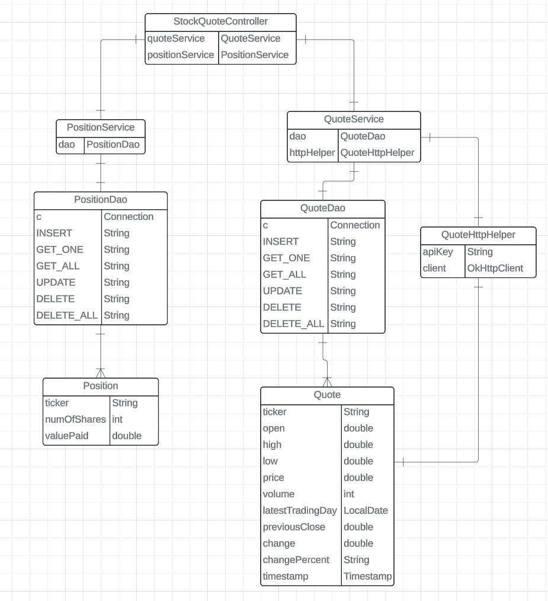

# Introduction
Java Implementation of a Stock Quote app that finds 
stock information in real time and stores it in a 
SQL database. Utilized JDBC and OkHttp libraries to 
communicate with RDBMS and Alpha Vantage Rapid API 
in Java as well as Jackson library to parse JSON stock
quote responses.

# Implementation
## ER Diagram

## Design Patterns
The PositionDao and QuoteDao patterns perform the 
CRUD operations for their respective Position and 
Quote objects. The Quote object encapsulate the 
JSON data retrieved by the HttpHelper class from 
the Alpha Vantage RapidAPI website. While the 
Position object encapsulates the user's input data.
They receive the stock quote or position information
from their respective service classes and then 
depending on the query given to the Controller 
class, will either insert, update, retrieve, or 
delete the specified data from the stock_quote 
database within their respective tables.

# Test
Testing was done in two different ways, one being 
integration testing where the classes were tested
in their entirety, and the other being the unit 
testing where the connections are mocked using 
mockito and only the implementation is tested. 
In this way, we can isolate the implementation 
from the database connection to be able to more
accurately determine the cause of bugs and issues
in the project. In both test processes the test data
is taken from the stock quote data at the time of 
testing and hardcoded into the expected result 
objects. The tests begin to differ in their database
setup, where the unit tests employ Mockito to 
manipulate the output of the DAO classes to give the
expected hard coded data. In this way, the database
connection is mocked and allows us to purely test the
implementation. In the Integration tests, the entire
classes are tested and any tests requiring database
access are initialized with Java.SQL's actual 
Connection class, the OkHttpClient class, and our 
implemented DatabaseConnectionManager class.
