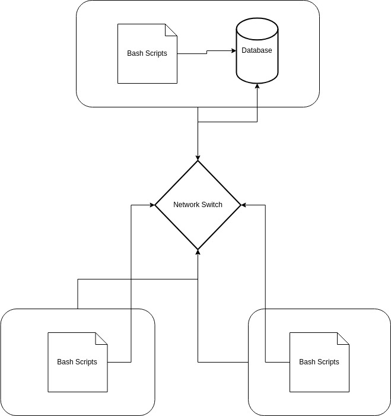

<<<<<<< HEAD
# Linux Cluster Monitoring Agent
This project is under development. Since this project follows the GitFlow, the final work will be merged to the main branch after Team Code Team.
=======
# Introduction
The Linux Cluster Monitoring project is a 
minimum viable product that demonstrates the 
effectiveness of the Cluster Monitoring 
Solution to help the LCA team meet their 
business needs. It utilizes `Linux command 
lines, Git, Bash scripts, PostgreSQL, Docker,
and cron` to monitor a system's hardware 
specifications and resource usage. It works 
by first setting up a `psql` instance to 
persist all the data. Said data is then 
gathered using two bash scripts 
`host_info.sh` and `host_usage.sh` to
gather the hosts hardware and usage info 
respectively and then store it into the 
database. The later script is ran 
continuously at one minute intervals using 
`cron`.

# Quick Start
### - Start a `psql` instance using psql_docker.sh
```bash 
./scripts/psql_docker.sh create db_username db_password
./scripts/psql_docker.sh start
``` 
### - Create tables using `ddl.sql`
```bash
psql -h localhost -U postgres -d host_agent -f sql/ddl.sql
```
### - Insert hardware specs data into the DB using `host_info.sh`
```bash
./scripts/host_info.sh psql_host psql_port db_name psql_user psql_password
```
### - Insert hardware usage data into the DB using `host_usage.sh`
```bash
bash scripts/host_usage.sh psql_host psql_port db_name psql_user psql_password
```
### - `Crontab` setup
```bash
bash> crontab -e
* * * * * bash /home/centos/dev/jrvs/bootcamp/linux_sql/host_agent/scripts/host_usage.sh psql_host psql_port db_name psql_user psql_password > /tmp/host_usage.log
```

# Implementation
the `psql` instance is created by first starting
the docker and pulling the latest postgres image.
We then create a docker volume called `pgdata`
and save the intended password as an environment
variable before creating and running the container
using the aforementioned password. After creating 
and running the container. We then use the script
to create the two tables to store the host hardware
and usage data using `sql` commands. The data is 
gathered using the two scripts uses text processing
software's such as `awk` and `tail` to extract the 
required values from the `vmstat` and `df` for the
host hardware and usage. Finally, the usage data
is recorded autonomously using `crontab`.

## Architecture


## Scripts
### - psql_docker.sh
starts the docker and checks to see if the container
exists as well as if the correct arguments were passed
before either creating/starting/stopping the container.
### - host_info.sh
extracts host hardware information and stores it
in the host_info table
### - host_usage.sh
extracts host resource usage and stores it in the
host_usage table
### -crontab
automates the host_usage.sh script to run every 
minute.

## Database Modelling
### - `host_info`
`id:` `SERIAL NOT NULL,`unique primary key of each entry (auto-increments)

`hostname:` `VARCHAR NOT NULL,`fully qualified hostname of the system

`cpu_number:` `INT2 NOT NULL,`number of cpu(s) or processor cores in the system

`cpu_architecture:` `VARCHAR NOT NULL,`the type of cpu(s) in the system

`cpu_model:` `VARCHAR NOT NULL,`the model of the cpu(s) in the system

`cpu_mhz:` `FLOAT8 NOT NULL,`the clock speed or frequency of the cpu(s)

`L2_cache:` `INT4 NOT NULL,`size of the L2 cache memory in the cpu(s)

`timestamp:` `TIMESTAMP NULL,`timestamp of when information was pulled

`total_mem:` `INT4 NOT NULL,`the total amount of system memory (RAM) available in the system

### - `host_usage`
`timestamp:` `TIMESTAMP NOT NULL,`timestamp of when information was pulled

`host_id:` `SERIAL NOT NULL,`id of the host in the host_info table whose resource usage is currently being calculated

`memory_free:` `INT4 NOT NULL,`amount of free memory in the system

`cpu_idle:` `INT2 NOT NULL,`percentage of time the cpu(s) spent idle during measurement interval

`cpu_kernel:` `INT2 NOT NULL,`percentage of cpu time spent executing kernel processes or system-level operations

`disk_io:` `INT4 NOT NULL,`information about block input and output

`disk_available:` `INT4 NOT NULL,`amount of available disk space on the filesystem

# Test
### psql_docker.sh
check status of the container
```bash
docker container inspect jrvs-psql
```
the status matched the expected output of 
the previous command, (running if argument was start and vice versa)
meaning the script was working as intended

### ddl.sql.sh
check if the tables exist by connecting to the
`psql` instance and then listing all the existing
tables.
```bash
psql -h localhost -U postgres -W
\dt
```
since the tables show up we know that the script
was running properly.

### host_info.sh
check if the entries were inputted by once again
connecting to the `psql` instance and then running
the `sql` command to list the tables
```bash
psql -h localhost -U postgres -W
SELECT * FROM host_info;
```
since the entry is outputted we know the script
was working as intended

### host_usage
check if the entries were inputted by once again
connecting to the `psql` instance and then running
the `sql` command to list the tables
```bash
psql -h localhost -U postgres -W
SELECT * FROM host_usage;
```
since the entry is outputted we know the script
was working as intended

# Deployment
we deploy the monitoring app to the JRD instance
and automate the host_usage.sh script using `crontab`
```bash
bash> crontab -e
* * * * * bash /home/centos/dev/jrvs/bootcamp/linux_sql/host_agent/scripts/host_usage.sh psql_host psql_port db_name psql_user psql_password > /tmp/host_usage.log
crontab -l 
psql -h localhost -U postgres -W
SELECT * FROM host_usage;
```
we can see the `host_usage.sh` script is inputting
table entries once every minute meaning the 
delpoyment/automation was successful

# Improvements
- handle hardware updates
- handle necessary software installations automatically
- have a script to automate crontab 
>>>>>>> feature/readme
